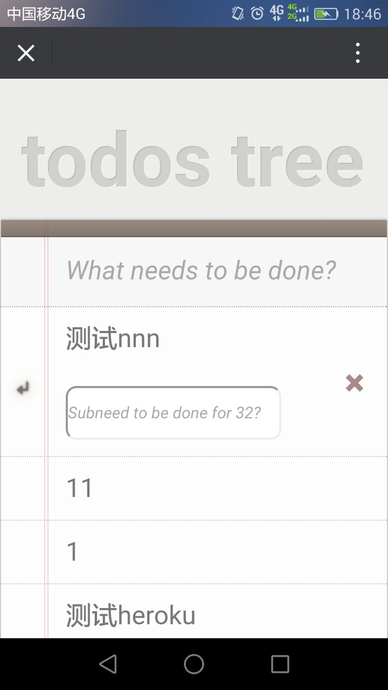

### 记录ClojureScript与React的学习经历, 包括reagent和om

##### 1. r/atom 
只要修改atom内的任意一值,整个应用的任意一引用到atom的地方,都会底层自动修改掉
```clojure
(defonce counter (r/atom 0))
```
##### 2. r/render-component
渲染模块,可以对cljs纯函数单独测试,单独显示,cljs repl交互式开发
```clojure
(defn todo-app [] [:h1 "test..."])
(r/render-component [todo-app] (. js/document (getElementById "app")))
```
##### 3. cljs.http
通过lambda的回调caller传出 `(:body response)`, 然后通过swap!或者reset!将其值放入atom的原子或者列表里面
```clojure

(ns todos.core
  (:require-macros [cljs.core.async.macros :refer [go]])
  (:require [reagent.core :as r :refer [atom]]
            [cljs-http.client :as http]
            [cljs.core.async :refer [<!]]))

(defonce todos-list-init
  (go (let [response
            (<!
             (http/get "http://127.0.0.1:3001/todos"
                       {:with-credentials? false
                        :query-params {"since" ""}}))]
        (let [body (:body response)]
          (reset! todos (zipmap  (map :id body) body) )
          ))))

(defn create-todo [text body]
  (go (let [response
            (<!
             (http/post "http://127.0.0.1:3001/todos"
                        {:with-credentials? false
                         :query-params {:title text}}))]
        (body (:body response))
        )))
        
(defn add-todo [text]
  (do
    (create-todo
     text
     #(swap! todos assoc (:id %) {:id (:id %) :title (:title %) :done false}))
    )
  )
  
```

##### 4. a,button标签点击事件
lambda响应函数 `{:on-* (fn [x] ..)}` 放在离标签最近的Hash里面
```clojure
[:li [:a {:on-click #(js/alert "这里是a标签点击事件")} "Active"  ]]
[:button.reply {:on-click #(js/alert id)}]
```
##### 5. label的双击修改事件on-double-click
当鼠标双击input时,把input变成可输入修改的模式的class
```clojure
[:label {:on-double-click #(reset! editing true)} title]
```
##### 6. input过程发生的三种常用的响应函数: input的键盘输入按下的事件on-key-down, 内容改变事件on-change, 点击input其他部分事件on-blur
* 当鼠标点input的其他部位时,保存update提交: on-blur
* 当改变input内容时修改input的值value: on-change
* 按下键盘,如果是回车13就保存,如果是Esc27就停止修改
```clojure
      [:input {:type "text" :value @val
               :id id :class class :placeholder placeholder
               :on-blur save
               :on-change #(reset! val (-> % .-target .-value))
               :on-key-down #(case (.-which %)
                               13 (save)
                               27 (stop)
                               nil)}]
```

##### 7. js副作用的写法: http://himera.herokuapp.com/synonym.html

```clojure

(clojure.string/split window.location.search #"=|\?|\&") ;; 得到完整的参数params
(-> js/window .-location .-href) ;; 得到完整的链接
(.. js/window -location -href) ;; 得到完整的链接
(.. js/window -location -search) ;; 得到完整的参数params

;; 时间
(js/Date.) ;;=> #inst "2016-11-11T08:41:21.877-00:00"
;; js => ` new Date().getFullYear() `
(.toTimeString (js/Date.)) ;; => "00:36:01 GMT-0800 (PST)"
(js/Date.now) ;; => 1478853434489
(.getYear (js/Date.)) ;;=> 116
(.getFullYear (js/Date.)) ;; => 2016

(defn current-time []
  (let [date (js/Date.)]
    (str (.getFullYear date) "-" (.getMonth date) "-" (.getDate date))
    ) )
(current-time) ;;=> "2016-10-11"

```

方法调用

```clojure
(.method object params)

(.log js/console "hello world!")
```
访问属性

```clojure
(.-property object)

(.-style div)

```
设置属性

```clojure

(set! (.-property object))

(set! (.-color (.-style div) "#234567"))

```

### [演示 heroku: rails api + clojurescript](http://todos-tree.herokuapp.com/todos-tree)


